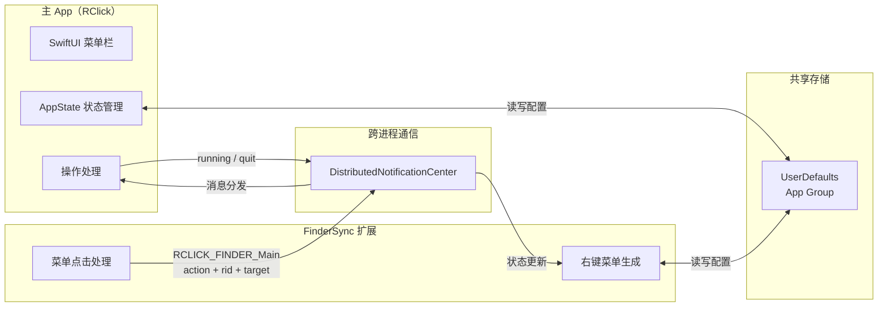

# AGENTS.md

本文件为 AI 编程助手（Claude Code、Codex 等）在此仓库中工作时提供指导。

## 项目概览

RClick 是一个 macOS 菜单栏应用，扩展 Finder 的右键菜单功能。支持通过右键菜单快速打开指定 App、创建文件模板、复制路径、AirDrop 分享等操作。

**技术栈：**
- Swift 6.2+（必须）
- SwiftUI（所有 UI 组件，禁止 AppKit UI）
- AppKit（仅限系统集成：NSWorkspace、NSPasteboard、文件操作）
- SwiftData（持久化存储）
- FinderSync 框架（注入 Finder 右键菜单）
- DistributedNotificationCenter（主 App 与扩展跨进程通信）
- Xcode 16+（开发环境）

## 双进程架构

RClick 由两个独立进程组成，通过 App Group 共享数据、通过 DistributedNotificationCenter 通信：



### 消息流向

| 方向 | 通知名 | 含义 |
|------|--------|------|
| Extension → App | `RCLICK_FINDER_Main` | 用户点击了菜单项，携带 `action`、`rid`、`target` |
| App → Extension | `running` | 主 App 运行中，携带 `target`（监听的目录列表） |
| App → Extension | `quit` | 主 App 退出 |

### 关键文件

| 文件 | 作用 |
|------|------|
| `RClick/RClickApp.swift` | App 入口 + AppDelegate，注册消息监听、处理所有操作 |
| `RClick/AppState.swift` | 全局状态管理（单例），管理 apps/actions/newFiles/dirs/cdirs |
| `FinderSyncExt/FinderSyncExt.swift` | Extension 入口，生成右键菜单、处理点击 |
| `RClick/Shared/Messager.swift` | 基于 DistributedNotificationCenter 的 IPC 封装 |
| `RClick/Model/RCBase.swift` | 数据模型（OpenWithApp、RCAction、NewFile、CommonDir） |
| `RClick/Model/Models.swift` | SwiftData `@Model` 定义 |
| `RClick/Shared/Constants.swift` | Key 枚举和 UserDefaults 常量 |
| `RClick/Settings/` | 设置界面（多个 Tab 页） |

## 构建与打包

### 开发构建
```bash
# Debug 构建
xcodebuild -project RClick.xcodeproj -scheme RClick -configuration Debug -derivedDataPath build ARCHS=arm64 build

# 或在 Xcode 中 Cmd+R 运行
```

### Release 构建与 DMG 打包
```bash
# Release 构建（需 Xcode 中已登录 Apple ID 且有有效 Provisioning Profile）
xcodebuild -project RClick.xcodeproj -scheme RClick -configuration Release -derivedDataPath build ARCHS=arm64 build

# 打包为 DMG
APP_PATH="build/Build/Products/Release/RClick.app"
VERSION=$(defaults read "$(pwd)/$APP_PATH/Contents/Info.plist" CFBundleShortVersionString)
TMP_DIR=$(mktemp -d)
mkdir -p "$TMP_DIR/RClick"
cp -R "$APP_PATH" "$TMP_DIR/RClick/"
ln -s /Applications "$TMP_DIR/RClick/Applications"
hdiutil create -volname "RClick" -srcfolder "$TMP_DIR/RClick" -ov -format UDZO "RClick-${VERSION}-arm64.dmg"
rm -rf "$TMP_DIR"
```

> **注意**：Release 构建需要 `com.apple.security.application-groups` entitlement，此 entitlements 需要有效的 Provisioning Profile。命令行 `xcodebuild` 无 Profile 时会失败，需在 Xcode 中完成 Archive。

## ⚠️ 常见陷阱（修改代码前必须了解）

### 1. 双进程 ID 一致性问题

`OpenWithApp` 的 `static let` 实例（如 `terminal`、`vscode`）会在两个进程中**各自懒初始化**，切勿使用 `UUID()` 作为默认 id。必须使用确定性 ID（如 `url.path`）：

```swift
// ✅ 正确：两个进程得到相同 ID
init(id: String = "", appURL url: URL) {
    self.id = id.isEmpty ? url.path : id
}

// ❌ 错误：两个进程生成不同 UUID
init(id: String = UUID().uuidString, appURL url: URL) { ... }
```

### 2. Application Groups 不可缺少

`RClick.entitlements` 和 `FinderSyncExt.entitlements` 都必须包含：
```xml
<key>com.apple.security.application-groups</key>
<array>
    <string>group.cn.wflixu.RClick</string>
</array>
```
缺失时 `UserDefaults.group`（suite="group.cn.wflixu.RClick"）两个进程各写各的，Extension 永远读不到主 App 保存的配置。

### 3. ID 匹配用 `==`，不要用 `contains`

```swift
// ✅ 正确
func getAppItem(rid: String) -> OpenWithApp? {
    return apps.first { $0.id == rid }
}

// ❌ 错误：空 id 会匹配任意 rid
func getAppItem(rid: String) -> OpenWithApp? {
    return apps.first { rid.contains($0.id) }
}
```

### 4. 首次加载默认数据后必须 save

```swift
// ✅ 正确：加载默认值后持久化
apps = OpenWithApp.defaultApps
try? save()

// ❌ 错误：只存内存，重启后 Extension 重新生成不同数据
apps = OpenWithApp.defaultApps
```

### 5. 修改 App/配置后必须通知 Extension

```swift
appState.addApp(item: newApp)
messager.sendMessage(name: "running", data: MessagePayload(action: "running", target: []))
```

### 6. Swift 6 严格并发要求

闭包中引用实例属性必须显式 `self.`：
```swift
NSWorkspace.shared.open([dir], withApplicationAt: appUrl, configuration: config) { _, error in
    if let error = error {
        self.logger.error("\(error)")  // 必须 self.logger
    }
}
```

### 7. 日志使用 @AppLog，不要用 print

```swift
@AppLog(category: "main")
private var logger

// ✅ 正确：logger 输出到 os.log
logger.info("open app: \(appUrl.path())")

// ❌ 错误：print 在 Release 构建和 Extension 进程中不可见
print("open app: \(appUrl.path())")
```

### 8. 文件路径不要硬编码 isDirectory

```swift
// ❌ 错误：文件路径被误标为目录
URL(fileURLWithPath: path, isDirectory: true)

// ✅ 正确
URL(fileURLWithPath: path, isDirectory: false)
```

## 通讯协议

### MessagePayload 格式
```swift
struct MessagePayload: Codable {
    var action: String    // "open" | "actioning" | "Create File" | "common-dirs" | "heartbeat"
    var target: [String]  // 目标文件/文件夹路径列表
    var rid: String       // 操作对应的资源 ID（App id / Action id 等）
    var trigger: String   // "ctx-items" | "ctx-container" | "ctx-sidebar" | "toolbar"
}
```

### 添加新操作类型
1. 在 `RCAction.all` 中添加新的静态实例
2. 在 `AppDelegate.actionHandler()` 的 switch 中添加 `case`
3. Extension 会自动通过 `createActionMenuItems()` 遍历 `appState.actions` 生成菜单项

### 添加新 App 打开类型
1. 在 `OpenWithApp.defaultApps` 中添加新的静态实例
2. 主 App 的 `openApp()` 负责实际打开逻辑
3. Extension 的 `createAppItems()` 自动生成对应菜单项

## 调试

```bash
# 清除 App Group UserDefaults（排除缓存干扰）
defaults delete group.cn.wflixu.RClick

# 查看主 App 日志
log stream --predicate 'subsystem == "cn.wflixu.RClick"' --level debug

# 查看 Extension 日志
log stream --predicate 'subsystem == "cn.wflixu.RClick.FinderSyncExt"' --level debug

# 验证 Extension 是否正确加载
pluginkit -m -v -i cn.wflixu.RClick.FinderSyncExt

# 重新注册 Extension
pluginkit -e use -i cn.wflixu.RClick.FinderSyncExt
```

## 关键约束

- 最低部署目标：macOS 15 Sequoia
- Swift 版本：6.2+（尽管 target 级别 override 为 5.0，新代码必须用 6.2 语法）
- UI：100% SwiftUI，AppKit 仅用于 `NSWorkspace`、`NSPasteboard`、`NSSharingService` 等系统集成
- 沙盒：App Sandbox + Hardened Runtime 均启用
- 签名：Debug 使用 `Apple Development`，Release 使用 `3rd Party Mac Developer Application`
- 菜单栏 App：`LSUIElement = YES`，无 Dock 图标
- 国际化：英语（主）+ 简体中文
